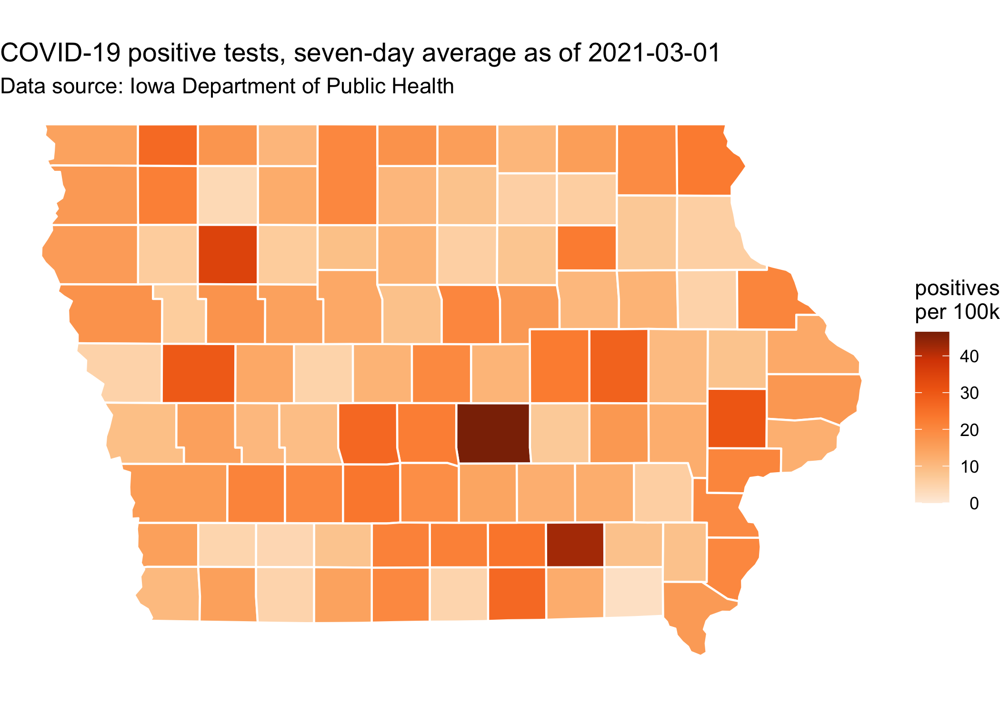
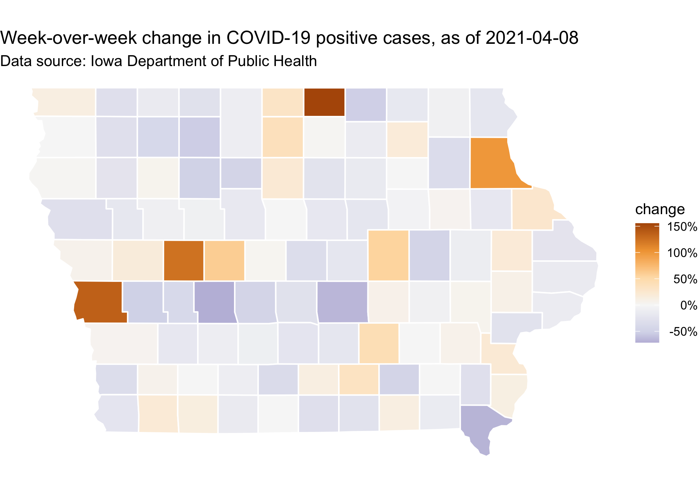

Compiled at 2021-06-29 17:25:15 UTC

<!-- README.md is generated from README.Rmd. Please edit that file -->

# covidIowa

<!-- badges: start -->

<!-- badges: end -->

The goal of this repository is to give a county-level summary of
COVID-19 cases in Iowa. The data is taken from a series of daily
snapshots of the [accessibility
page](https://coronavirus.iowa.gov/pages/access) provided by the Iowa
Department of Public Health.

If you want to work with the data yourself, all the code I use is
published this repository, check out the [`workflow`](workflow)
directory. Processed datasets are also available here:

  - [`iowa_county_meta.csv`](https://raw.githubusercontent.com/ijlyttle/covidIowa/master/workflow/data/99-publish/iowa_county_meta.csv):
    county metadata, things like estimated 2019 population from
    [ICIP](https://www.icip.iastate.edu/tables/population/counties-estimates)
    at Iowa State University.

  - [`iowa_county_data.csv`](https://raw.githubusercontent.com/ijlyttle/covidIowa/master/workflow/data/99-publish/iowa_county_data.csv):
    daily numbers by county from IDPH, going back to 2020-05-25.

  - [`iowa_county_cases_week.csv`](https://raw.githubusercontent.com/ijlyttle/covidIowa/master/workflow/data/99-publish/iowa_county_data.csv):
    In addition to county metadata, total positive-tests (and per 100k),
    one week average of daily positive-tests (and per 100k), and
    week-over-week change in positive tests (as a ratio).

  - [`iowa_cases_week.csv`](https://raw.githubusercontent.com/ijlyttle/covidIowa/master/workflow/data/99-publish/iowa_cases_week.csv):
    Similar to `iowa_county_cases_week.csv`, but aggregated for the
    entire state.

## Plots

## Tables as of 2021-06-29

As of 2021-06-29, IPDH is reporting 93 new cases since the previous day.

For the entire state, over the past week:

|       date | daily pos. (week avg.) | daily pos. per 100k (week avg.) | week-over-week change |
| ---------: | ---------------------: | ------------------------------: | --------------------: |
| 2021-06-29 |                   72.3 |                             2.3 |               \-10.0% |
| 2021-06-28 |                   69.0 |                             2.2 |                \-2.0% |
| 2021-06-27 |                   67.6 |                             2.1 |               \-10.4% |
| 2021-06-26 |                   68.0 |                             2.2 |                \-9.6% |
| 2021-06-25 |                   68.1 |                             2.2 |               \-16.8% |
| 2021-06-24 |                   68.3 |                             2.2 |               \-18.1% |
| 2021-06-23 |                   70.0 |                             2.2 |               \-15.5% |

For the most-populated counties:

|        county | daily pos. (week avg.) | daily pos. per 100k (week avg.) | week-over-week change |
| ------------: | ---------------------: | ------------------------------: | --------------------: |
|          Polk |                    7.3 |                             1.5 |               \-33.3% |
|          Linn |                    6.0 |                             2.6 |               \-14.0% |
|         Scott |                    2.3 |                             1.3 |               \-14.8% |
|       Johnson |                    1.9 |                             1.2 |                  5.3% |
|    Black Hawk |                   14.6 |                            11.1 |                \-2.7% |
|      Woodbury |                    1.0 |                             1.0 |               \-22.2% |
|       Dubuque |                    2.6 |                             2.6 |                  0.0% |
|         Story |                    1.3 |                             1.3 |                \-5.9% |
|        Dallas |                    0.9 |                             0.9 |               \-18.8% |
| Pottawattamie |                    0.9 |                             0.9 |               \-38.1% |

Most positive-cases, per-capita:

|     county | daily pos. (week avg.) | daily pos. per 100k (week avg.) | week-over-week change |
| ---------: | ---------------------: | ------------------------------: | --------------------: |
|      Adams |                    0.6 |                            15.9 |                 57.1% |
| Black Hawk |                   14.6 |                            11.1 |                \-2.7% |
|    Webster |                    3.6 |                             9.9 |                 88.2% |
|       Lyon |                    1.1 |                             9.7 |                 87.5% |
|   Cherokee |                    0.9 |                             7.6 |                 85.7% |
|    Decatur |                    0.6 |                             7.3 |                 37.4% |
| Winneshiek |                    1.4 |                             7.1 |                  6.3% |
|     Wright |                    0.9 |                             6.8 |                 62.5% |
|     Monona |                    0.6 |                             6.6 |                  9.9% |
|   Humboldt |                    0.6 |                             6.0 |                 37.4% |

Most growth in positive cases, week-over-week:

|   county | daily pos. (week avg.) | daily pos. per 100k (week avg.) | week-over-week change |
| -------: | ---------------------: | ------------------------------: | --------------------: |
|   Warren |                    1.3 |                             2.5 |                128.6% |
|  Webster |                    3.6 |                             9.9 |                 88.2% |
|     Lyon |                    1.1 |                             9.7 |                 87.5% |
| Cherokee |                    0.9 |                             7.6 |                 85.7% |
|      Lee |                    2.0 |                             5.9 |                 75.0% |
|   Wright |                    0.9 |                             6.8 |                 62.5% |
|    Adams |                    0.6 |                            15.9 |                 57.1% |
| Marshall |                    1.9 |                             4.7 |                 53.9% |
|      Ida |                    0.3 |                             4.2 |                 50.1% |
|   Hardin |                    0.6 |                             3.4 |                 37.4% |

Biggest decline in positive cases, week-over-week:

|        county | daily pos. (week avg.) | daily pos. per 100k (week avg.) | week-over-week change |
| ------------: | ---------------------: | ------------------------------: | --------------------: |
|       Audubon |                  \-0.3 |                           \-5.2 |               \-61.6% |
|      Buchanan |                    0.1 |                             0.7 |               \-52.9% |
|   Buena Vista |                    0.3 |                             1.5 |               \-50.0% |
|      Crawford |                    0.0 |                             0.0 |               \-41.7% |
|        Bremer |                    0.4 |                             1.7 |               \-41.2% |
| Pottawattamie |                    0.9 |                             0.9 |               \-38.1% |
|         Sioux |                    0.3 |                             0.8 |               \-35.7% |
|        Keokuk |                    0.3 |                             2.8 |               \-35.7% |
|          Polk |                    7.3 |                             1.5 |               \-33.3% |
|        Benton |                    1.1 |                             4.5 |               \-31.8% |
