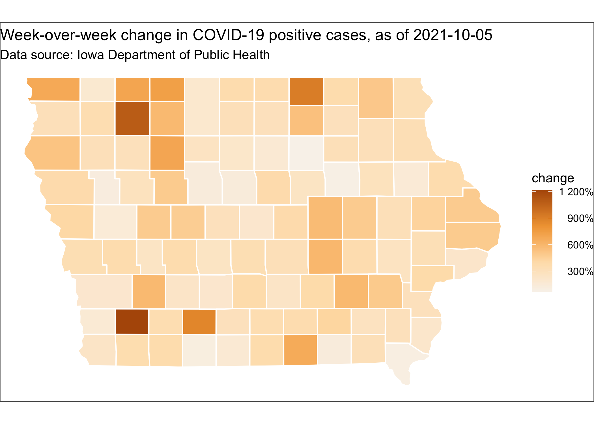

Compiled at 2021-03-21 17:04:54 UTC

<!-- README.md is generated from README.Rmd. Please edit that file -->

# covidIowa

<!-- badges: start -->

<!-- badges: end -->

The goal of this repository is to give a county-level summary of
COVID-19 cases in Iowa. The data is taken from a series of daily
snapshots of the [accessibility
page](https://coronavirus.iowa.gov/pages/access) provided by the Iowa
Department of Public Health.

If you want to work with the data yourself, all the code I use is
published this repository, check out the [`workflow`](workflow)
directory. Processed datasets are also available here:

  - [`iowa_county_meta.csv`](https://raw.githubusercontent.com/ijlyttle/covidIowa/master/workflow/data/99-publish/iowa_county_meta.csv):
    county metadata, things like estimated 2019 population from
    [ICIP](https://www.icip.iastate.edu/tables/population/counties-estimates)
    at Iowa State University.

  - [`iowa_county_data.csv`](https://raw.githubusercontent.com/ijlyttle/covidIowa/master/workflow/data/99-publish/iowa_county_data.csv):
    daily numbers by county from IDPH, going back to 2020-05-25.

  - [`iowa_county_cases_week.csv`](https://raw.githubusercontent.com/ijlyttle/covidIowa/master/workflow/data/99-publish/iowa_county_data.csv):
    In addition to county metadata, total positive-tests (and per 100k),
    one week average of daily positive-tests (and per 100k), and
    week-over-week change in positive tests (as a ratio).

  - [`iowa_cases_week.csv`](https://raw.githubusercontent.com/ijlyttle/covidIowa/master/workflow/data/99-publish/iowa_cases_week.csv):
    Similar to `iowa_county_cases_week.csv`, but aggregated for the
    entire state.

## Plots

## Tables as of 2021-03-21

As of 2021-03-21, IPDH is reporting 317 new cases since the previous
day.

For the entire state, over the past week:

|       date | daily pos. (week avg.) | daily pos. per 100k (week avg.) | week-over-week change |
| ---------: | ---------------------: | ------------------------------: | --------------------: |
| 2021-03-21 |                  419.0 |                            13.3 |               \-17.0% |
| 2021-03-20 |                  414.0 |                            13.1 |               \-10.9% |
| 2021-03-19 |                  428.7 |                            13.6 |               \-17.6% |
| 2021-03-18 |                  413.6 |                            13.1 |               \-24.3% |
| 2021-03-17 |                  334.0 |                            10.6 |               \-42.1% |
| 2021-03-16 |                  448.3 |                            14.2 |               \-15.1% |
| 2021-03-15 |                  462.9 |                            14.7 |                \-4.2% |

For the most-populated counties:

|        county | daily pos. (week avg.) | daily pos. per 100k (week avg.) | week-over-week change |
| ------------: | ---------------------: | ------------------------------: | --------------------: |
|          Polk |                   95.7 |                            19.5 |               \-10.8% |
|          Linn |                   15.7 |                             6.9 |                  6.4% |
|         Scott |                   24.1 |                            14.0 |                \-3.8% |
|       Johnson |                   12.4 |                             8.2 |                  8.0% |
|    Black Hawk |                    9.9 |                             7.5 |               \-37.7% |
|      Woodbury |                   28.4 |                            27.6 |                \-6.8% |
|       Dubuque |                    7.6 |                             7.8 |               \-10.4% |
|         Story |                   13.3 |                            13.7 |               \-15.3% |
|        Dallas |                   14.3 |                            15.3 |               \-29.1% |
| Pottawattamie |                   16.1 |                            17.3 |                  6.2% |

Most positive-cases, per-capita:

|    county | daily pos. (week avg.) | daily pos. per 100k (week avg.) | week-over-week change |
| --------: | ---------------------: | ------------------------------: | --------------------: |
| Dickinson |                    9.6 |                            55.5 |                 23.3% |
|      Clay |                    5.3 |                            33.0 |               \-22.8% |
|   O’Brien |                    4.3 |                            31.2 |                 23.3% |
|     Wayne |                    2.0 |                            31.1 |               \-16.0% |
|       Ida |                    2.0 |                            29.2 |               \-48.8% |
|     Emmet |                    2.6 |                            27.9 |                 38.9% |
|  Woodbury |                   28.4 |                            27.6 |                \-6.8% |
|   Kossuth |                    4.0 |                            27.0 |                 29.6% |
|  Plymouth |                    6.3 |                            25.0 |                \-3.8% |
|   Wapello |                    8.6 |                            24.5 |               \-16.3% |

Most growth in positive cases, week-over-week:

|     county | daily pos. (week avg.) | daily pos. per 100k (week avg.) | week-over-week change |
| ---------: | ---------------------: | ------------------------------: | --------------------: |
|    Fremont |                    1.4 |                            20.5 |                183.4% |
| Montgomery |                    0.6 |                             5.8 |                 57.1% |
|  Appanoose |                    1.3 |                            10.3 |                 45.5% |
|   Delaware |                    3.3 |                            19.3 |                 42.9% |
|   Humboldt |                    1.9 |                            19.4 |                 42.8% |
|      Sioux |                    8.1 |                            23.4 |                 42.2% |
|      Emmet |                    2.6 |                            27.9 |                 38.9% |
|      Worth |                    0.7 |                             9.7 |                 33.3% |
|  Chickasaw |                    0.9 |                             7.2 |                 30.0% |
|    Kossuth |                    4.0 |                            27.0 |                 29.6% |

Biggest decline in positive cases, week-over-week:

|      county | daily pos. (week avg.) | daily pos. per 100k (week avg.) | week-over-week change |
| ----------: | ---------------------: | ------------------------------: | --------------------: |
|      Benton |                    1.3 |                             5.0 |               \-60.0% |
|     Madison |                    1.7 |                            10.5 |               \-59.6% |
|        Page |                    1.7 |                            11.3 |               \-55.8% |
|      Marion |                    2.6 |                             7.7 |               \-50.0% |
|         Ida |                    2.0 |                            29.2 |               \-48.8% |
|     Carroll |                    1.9 |                             9.2 |               \-48.7% |
|      Clarke |                    0.4 |                             4.6 |               \-47.3% |
|       Cedar |                    1.4 |                             7.7 |               \-46.9% |
| Cerro Gordo |                    2.3 |                             5.4 |               \-46.5% |
|    Cherokee |                    2.3 |                            20.3 |               \-45.2% |
