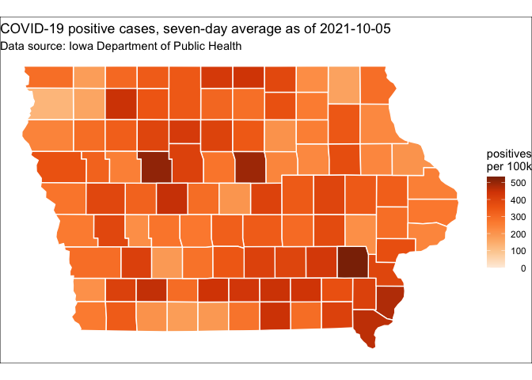
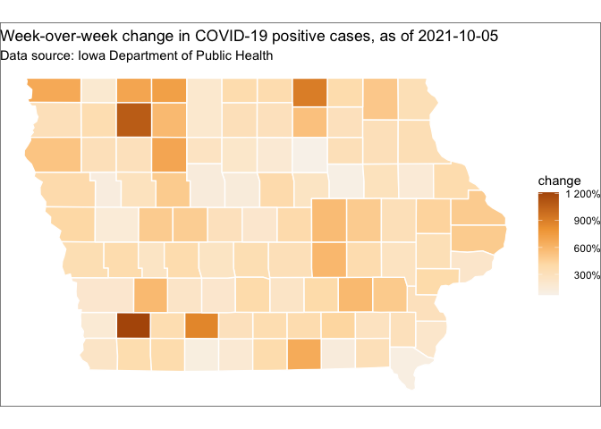

04-explore
================
Compiled at 2021-05-19 17:18:45 UTC

``` r
here::i_am(paste0(params$name, ".Rmd"), uuid = "490e689e-0ba3-47f9-8e87-8e1d74cdd841")
```

The purpose of this document is explore the Iowa COVID data, by county.

``` r
library("conflicted")
library("vroom")
library("dplyr")
library("readr")
```

    ## Registered S3 methods overwritten by 'readr':
    ##   method           from 
    ##   format.col_spec  vroom
    ##   print.col_spec   vroom
    ##   print.collector  vroom
    ##   print.date_names vroom
    ##   print.locale     vroom
    ##   str.col_spec     vroom

``` r
library("USAboundaries") # also install_github("ropensci/USAboundariesData")
library("USAboundariesData") # also install_github("ropensci/USAboundariesData")
library("sf")
```

    ## Linking to GEOS 3.8.1, GDAL 3.1.4, PROJ 6.3.1

``` r
library("glue")
library("ggplot2")

conflict_prefer("filter", "dplyr")
```

    ## [conflicted] Will prefer dplyr::filter over any other package

``` r
conflict_prefer("select", "dplyr")
```

    ## [conflicted] Will prefer dplyr::select over any other package

``` r
# create or *empty* the target directory, used to write this file's data: 
projthis::proj_create_dir_target(params$name, clean = TRUE)

# function to get path to target directory: path_target("sample.csv")
path_target <- projthis::proj_path_target(params$name)

# function to get path to previous data: path_source("00-import", "sample.csv")
path_source <- projthis::proj_path_source(params$name)
```

## Tasks

### Read

``` r
iowa_county_meta <- 
  vroom(path_source("01-county-metadata", "iowa_county_meta.csv"))
```

    ## Rows: 99
    ## Columns: 7
    ## Delimiter: ","
    ## chr [3]: county, abbreviation, population_group
    ## dbl [4]: fips, lon, lat, population
    ## 
    ## Use `spec()` to retrieve the guessed column specification
    ## Pass a specification to the `col_types` argument to quiet this message

``` r
iowa_county_data <- vroom(
  path_source("03-merge", "iowa_county_data.csv")
) 
```

    ## Rows: 35,207
    ## Columns: 7
    ## Delimiter: ","
    ## chr  [1]: county
    ## dbl  [5]: fips, tests, cases, recovered, deaths
    ## date [1]: date
    ## 
    ## Use `spec()` to retrieve the guessed column specification
    ## Pass a specification to the `col_types` argument to quiet this message

### Wrangle

Let’s define some functions:

``` r
growth <- function(x) {
  # week-over-week growth, normalized by previous week
  
  # use "+ 1" in denominator to avoid division by zero
  result <- (x - dplyr::lag(x, 7)) / (dplyr::lag(x, 7) + 1) 
  
  # three digits should be more than enough
  round(result, 3)
}

per_100k <- function(x, pop) {
  result <- x / (pop / 1e5)
  
  round(result, 3)
}
```

``` r
iowa_county_cases_week <-
  iowa_county_data %>%
  right_join(iowa_county_meta, by = c("fips", "county")) %>%
  group_by(county) %>%
  arrange(date, desc(population)) %>%
  transmute(
    date,
    fips,
    county,
    population,
    population_group,
    cases_total = cases, 
    cases_total_per100k = per_100k(cases_total, population),
    cases_avg_week = ((cases - dplyr::lag(cases_total, 7)) / 7) %>% round(3) ,
    cases_avg_week_per100k = per_100k(cases_avg_week, population),
    cases_week_growth = growth(cases_avg_week)
  ) %>%
  print()  
```

    ## # A tibble: 34,855 x 10
    ## # Groups:   county [99]
    ##    date        fips county        population population_group cases_total
    ##    <date>     <dbl> <chr>              <dbl> <chr>                  <dbl>
    ##  1 2020-05-25 19153 Polk              490161 large                   3774
    ##  2 2020-05-25 19113 Linn              226706 large                    935
    ##  3 2020-05-25 19163 Scott             172943 mid-large                337
    ##  4 2020-05-25 19103 Johnson           151140 mid-large                602
    ##  5 2020-05-25 19013 Black Hawk        131228 mid-large               1682
    ##  6 2020-05-25 19193 Woodbury          103107 mid-large               2624
    ##  7 2020-05-25 19061 Dubuque            97311 mid-large                323
    ##  8 2020-05-25 19169 Story              97117 mid-large                 95
    ##  9 2020-05-25 19049 Dallas             93453 mid-large                857
    ## 10 2020-05-25 19155 Pottawattamie      93206 mid-large                212
    ## # … with 34,845 more rows, and 4 more variables: cases_total_per100k <dbl>,
    ## #   cases_avg_week <dbl>, cases_avg_week_per100k <dbl>, cases_week_growth <dbl>

``` r
iowa_cases_week <-
  iowa_county_data %>%
  group_by(date) %>%
  summarise(
    cases = sum(cases)
  ) %>%
  transmute(
    date,
    population = sum(iowa_county_meta$population),
    cases_total = cases, 
    cases_total_per100k = per_100k(cases_total, population),
    cases_avg_week = ((cases - dplyr::lag(cases_total, 7)) / 7) %>% round(3) ,
    cases_avg_week_per100k = per_100k(cases_avg_week, population),
    cases_week_growth = growth(cases_avg_week)
  )
```

## Plot

We just want the latest day:

``` r
iowa_county_cases_week_current <- 
  iowa_county_cases_week %>%
  filter(date == max(date))
```

``` r
date <- unique(iowa_county_cases_week_current$date)
```

``` r
iowa_map <- us_counties(resolution = "low", state = "Iowa")
```

``` r
iowa_plot_data <- 
  iowa_map %>%
  transmute(fips = as.numeric(geoid), geometry) %>%
  left_join(iowa_county_meta, by = "fips") %>%
  left_join(
    iowa_county_cases_week_current %>% select(-population, -population_group), 
    by = c("fips", "county")
  )

iowa_ggplot <- function(.data, var) {
  ggplot(.data) + 
    geom_sf(aes(fill = {{ var }}), color = "white") + 
    theme_void() + 
    theme(
      legend.text.align = 1 # right-justify
    )
}  
```

``` r
gg_iowa_cases <-
  iowa_ggplot(iowa_plot_data, cases_avg_week_per100k) +
  scale_fill_distiller(
    palette = "Oranges", 
    direction = 1,
    limits = c(0, NA)
  ) +
  labs(
    title = glue("COVID-19 positive cases, seven-day average as of {date}"),
    subtitle = "Data source: Iowa Department of Public Health",
    fill = "positives\nper 100k"
  )

gg_iowa_cases
```

<!-- -->

``` r
# see https://github.com/tidyverse/ggplot2/issues/3738#issuecomment-583750802
mid_rescaler <- function(mid = 0) {
  function(x, to = c(0, 1), from = range(x, na.rm = TRUE)) {
    scales::rescale_mid(x, to, from, mid)
  }
}

gg_iowa_change <- 
  iowa_ggplot(iowa_plot_data, cases_week_growth) +
  scale_fill_distiller(
    palette = "PuOr", 
    rescaler = mid_rescaler(),
    labels = scales::label_percent()
  ) +
  labs(
    title = glue("Week-over-week change in COVID-19 positive cases, as of {date}"),
    subtitle = "Data source: Iowa Department of Public Health",
    fill = "change"
  )  

gg_iowa_change
```

<!-- -->

Let’s write out data:

``` r
ggsave(path_target("iowa_cases.png"), plot = gg_iowa_cases, width = 7, height = 5)
ggsave(path_target("iowa_change.png"), plot = gg_iowa_change, width = 7, height = 5)

write_csv(
  iowa_cases_week, 
  path_target("iowa_cases_week.csv")
)

write_csv(
  iowa_county_cases_week, 
  path_target("iowa_county_cases_week.csv")
)
```

## Files written

These files have been written to the target directory,
`data/04-explore`:

``` r
projthis::proj_dir_info(path_target())
```

    ## # A tibble: 4 x 4
    ##   path                       type         size modification_time  
    ##   <fs::path>                 <fct> <fs::bytes> <dttm>             
    ## 1 iowa_cases.png             file       197.2K 2021-05-19 17:18:53
    ## 2 iowa_cases_week.csv        file        19.1K 2021-05-19 17:18:53
    ## 3 iowa_change.png            file       191.4K 2021-05-19 17:18:53
    ## 4 iowa_county_cases_week.csv file         2.3M 2021-05-19 17:18:53
